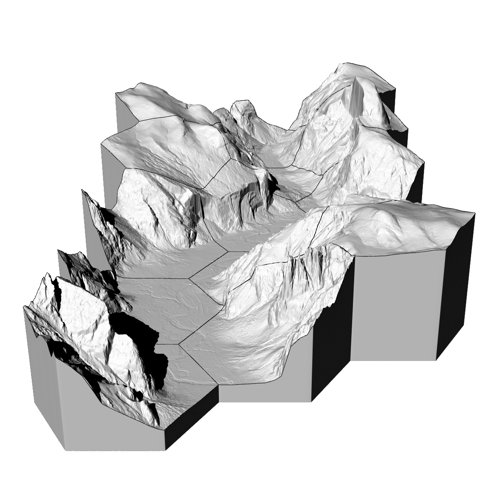

# Computational Ecology

In this studio you will learn computational methods for ecological modeling
and use them to plan and design habitat corridors
for the [Yellowstone to Yukon](https://y2y.net/) conservation initiative.
This studio will introduce advanced topics
in landscape ecology and biodiversity conservation
such as shifting ecological baselines, process-form interaction,
systematic conservation planning, and climate change adaptation.
You will learn how to model ecological patterns
and simulate ecological processes
using Geographic Information Systems (GIS).
You will learn visual programming, geospatial programming in Python,
digital fabrication methods, and advanced 3D rendering.
You will apply these theories and methods to
plan an ecological network with habitat corridors
to reconnect fragmented landscapes.
Each week you will spend
a day in a seminar discussing ecological theory and its applications,
a day in a workshop learning new computational methods,
and a day developing your projects.
There will be an optional field trip to Yellowstone National Park.

---

**Topics** landscape ecology | form and process | shifting baselines |
digital fabrication | geospatial programming | suitability | viewsheds |
urbanization | fire simulation | flood simulation | landscape planning

---

**Themes** | island biogeography | corridors | prioritization |
biodiversity hotspots | dynamic reserves | shifting baselines |
range shift | fragmentation

---

**Assignments** | [Projects](projects.md)

**Resources** | [Geospatial data sources](geospatial-data-sources.md)

**Software** | [GRASS GIS](https://grass.osgeo.org) |
[Rhino](https://www.rhino3d.com/) |
[Blender](https://www.blender.org/)

**Add-ons** |
[LCorridors](https://github.com/LEEClab/LS_CORRIDORS) |
[Itzi](https://www.itzi.org/) |
[r.geomorphon](https://grass.osgeo.org/grass74/manuals/addons/r.geomorphon.html) |
[r.skyview](https://grass.osgeo.org/grass74/manuals/addons/r.skyview.html) |
[r.stream](https://grasswiki.osgeo.org/wiki/R.stream.*_modules) |
[r.sun.daily](https://grass.osgeo.org/grass74/manuals/addons/r.sun.daily.html) |
[r.viewshed.cva][https://grass.osgeo.org/grass74/manuals/addons/r.viewshed.cva.html] |
[r.futures](https://grass.osgeo.org/grass74/manuals/addons/r.futures.html) |
[RhinoTerrain](http://www.rhinoterrain.com/en/home.html) |
[RhinoCAM](https://mecsoft.com/rhinocam-software/) |
[BlenderGIS](https://github.com/domlysz/BlenderGIS) |
[LowPoly Factory](https://blendermarket.com/products/lowpoly-factory)

**Libraries** | [Xfrog](http://xfrog.com/)

**Tutorials** |
[Intro to GRASS GIS](http://ncsu-geoforall-lab.github.io/grass-intro-workshop/) |
[lecture.lsu.edu/](https://lecture.lsu.edu/) |
[BlenderGIS wiki](https://github.com/domlysz/BlenderGIS/wiki)

---

## Contents

**Field Trip:** | [Yellowstone](projects.md#field-trip)

1. **Landscape ecology**
    1. [Landscape ecology](landscape-ecology.md)
    1. [Form and process](.md)
    1. [Baselines](.md)
    1. [Digital fabrication](.md)

**Project:** | [Mapping and analysis](projects.md#mapping-and-analysis)

2. **Ecological modeling**
    1. [Geospatial programming](.md)
    1. [Suitability](.md)
    1. [Viewsheds](.md)
    1. [Corridors](.md)
    1. [Urbanization](.md)
    1. [Fire simulation](.md)
    1. [Flood simulation](.md)

**Project:** | [Planning methodology](projects.md#planning-methodology)

3. **Landscape planning**
    1. [Landscape planning](.md)
    1. [Rendering](.md)

**Project:** | [Landscape planning](projects.md#landscape-planning)

---

## License
Open educational materials licensed CC BY-SA 4.0
by Brendan Harmon :monkey_face:.
The license does not apply to logos, fonts, linked material, quotations, or
reprinted images by other authors, which may have different licenses.
The fonts used in this repository are licensed under the SIL Open Font License
by their authors. The syllabus is based on a latex template by Kieran Healy
hosted at https://github.com/kjhealy/latex-custom-kjh.
